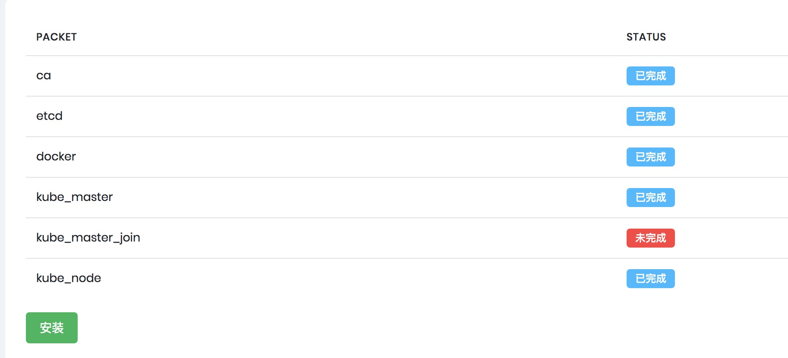
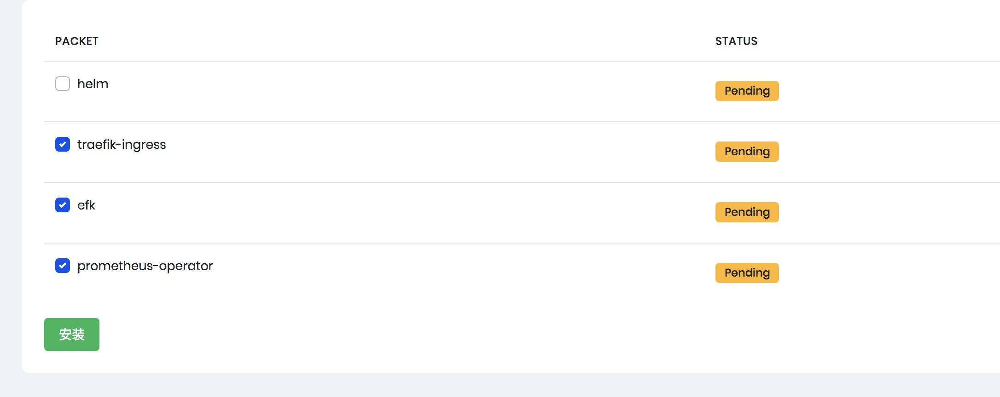
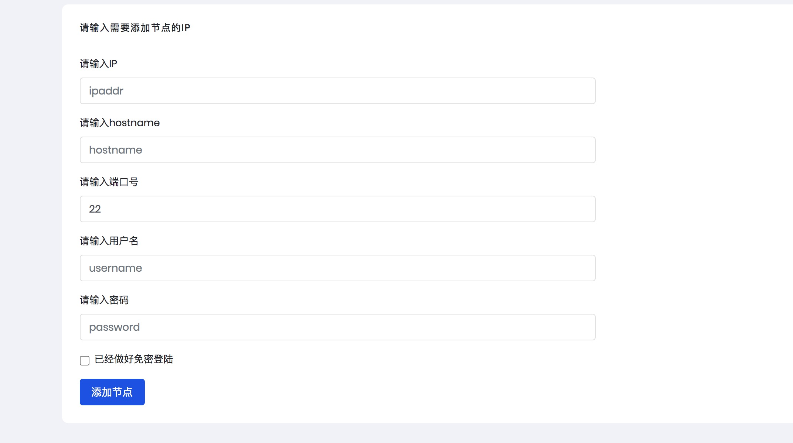

# k8s_install
包括k8s安装, 外部etcd安装, k8s node节点以及master节点扩展.所使用的其他外部插件如下:
网络: calico
日志: es+fluentd+kibana
监控: prometheus+grafana
sc: cephrbd
ingress: traefik
如有外部插件如有替代方案进入[credit_k8s/roles/](./credit_k8s/roles/)下修改即可.

## python版本说明
因为python的ansible-playbook在python2和python3上使用方法上存在差异,所以统一使用python3
python3 下载地址:
https://www.python.org/downloads/source/

## hosts文件说明
hosts文件中因为分组名称在使用ansible安装时会通过分组名来获取服务ip,所以group名称最好不做修改,分组调用的文件会统一在defaults/main.yml下定义变量.
默认运行文件保存位置 /opt/kube/bin
默认证书文件保存位置 /opt/ssl

## 启动命令
```
git clone https://github.com/airring/k8s_install
cd k8s_install
pip3 install -r ./requirements.txt

# 同步ansible hosts文件,如果本之前有安装ansible需要将主名和变量复制进去
cp ./hosts /etc/ansible/hosts

# 关闭host认证
sed -i 's/#host_key_checking = False/host_key_checking = False/' /etc/ansible/ansible.cfg

python3 manage.py runserver 0.0.0.0:8080
```
## hosts参数说明
<span style="color: red"> DEFAULE_DOMAIN kube-apiserver调用域名,需要将域名解析至master服务器上,不然后续初始化会报错 </span>
SERVICE_CIDR podIP段
KIBANA_URL kibana ingress所使用的域名,需要修改为自己的域名 
KIBA_CN kibana中文开关

## 证书说明
证书模版分别放置位置为:
```
ca : credit_k8s/roles/ca/templates
etcd : credit_k8s/roles/etcd/templates
```
k8s其他证书皆为以来ca证书生成,如果需要更新证书替换ca证书即可


## 开始运行
打开 ip:8080/init 进入初始化页面,比如我的环境为 192.168.3.50即:

http://192.168.3.50:8080/init

因为生成证书需要安装cfssl相关工具,也可以手动将安装包安装至/opt/目录下,然后勾选自己下载:


跳转至安装页面后点击安装即可

### 因为默认为使用多master节点,如果使用单master节点会出现master_join安装失败,并不影响后续使用



## cephrbd安装(可选)
如果有需要数据持久化的方案可以选择安装ceph

ceph安装分为2步:

1.ceph安装以及资源池生成,创建osd默认为添加所有的空闲硬盘,默认使用pool name为k8s,如果需要手动指定请修改
[credit_k8s/roles/ceph/tasks/main.yml](./credit_k8s/roles/ceph/tasks/main.yml)

2.在k8s上添加rbd,导入ceph的用户证书以及生成ceph的sc 证书生成[credit_k8s/roles/create-cephuser/tasks/main.yml](./credit_k8s/roles/create-cephuser/tasks/main.yml)

 rbd生成,以及sc生成[credit_k8s/roles/add-cephsc/tasks/main.yml](./credit_k8s/roles/add-cephsc/tasks/main.yml)

创建完成以后可以创建一个pvc测试会默认关联pv从ceph申请创建image并绑定

sc模版 [credit_k8s/roles/add-cephsc/templates/storageclass-ceph.yaml](./credit_k8s/roles/add-cephsc/templates/storageclass-ceph.yaml)

rbd模版 [credit_k8s/roles/add-cephsc/templates/external-storage-rbd.yaml](./credit_k8s/roles/add-cephsc/templates/external-storage-rbd.yaml)

## 插件安装
网络插件在kubemaster安装的时候会默认选择calico
如果需要修改网络插件,先删除calico再进行安装

helm插件因为安装较大,可以选择自行安装,避免自动安装超时,因为efk和prometheus依赖helm来安装,所以请务必确认helm已经安装完成
```
cd /tmp
wget https://get.helm.sh/helm-v3.2.1-linux-amd64.tar.gz
cd /tmp/; tar zxvf ./helm-v3.2.1-linux-amd64.tar.gz;mv linux-amd64/helm /usr/local/bin/helm
```
因为efk和prometheus依赖helm来安装,所以请务必确认helm已经安装完成

traefik-ingress所使用namespace为ingress,需要请自行修改
[credit_k8s/roles/traefik-ingress/templates/traefik-ingress.yaml](./credit_k8s/roles/traefik-ingress/templates/traefik-ingress.yaml)



ingress访问方式为nodeip:30001,管理页面为nodeip:30002

可以在前端设置负载方式访问80端口负载至nodeip:30001即可通过配置的域名来访问kibana和prometheus

因为kube-proxy默认监听ip为127.0.0.1,所以需要手动修改configmap

```
kubectl -n kube-system edit cm kube-proxy
# 找到metricsBindAddress改成
metricsBindAddress: 0.0.0.0:10249
```
修改完成以后需要重启kube-proxy即可获取到数据

## 节点添加



按需求输入需要添加的节点相关信息即可
如果勾选已做好免密登陆,则不需要输入密码
因为没有hosts文件没有做去重判断,如果重复添加,请手动删除/etc/ansible/hosts下的重复信息