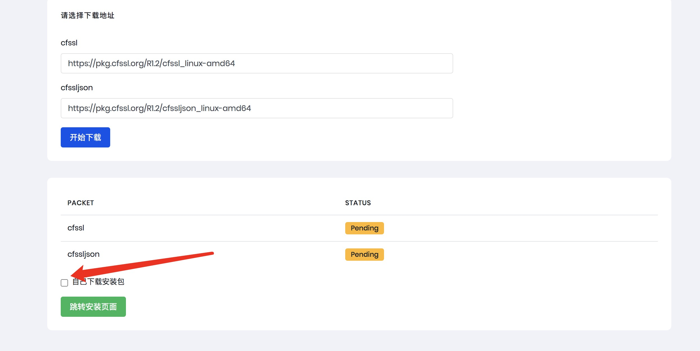

# k8s_install
## python版本说明
因为python的ansible-playbook在python2和python3上使用方法上存在差异,所以统一使用python3
python3 下载地址:
https://www.python.org/downloads/source/

## hosts文件说明
hosts文件中因为分组名称在使用ansible安装时会通过分组名来获取服务ip,所以group名称最好不做修改,分组调用的文件会统一在defaults/main.yml下定义变量.
默认运行文件保存位置 /opt/kube/bin
默认证书文件保存位置 /opt/ssl

## 启动命令
```
git clone https://github.com/airring/k8s_install
cd k8s_install
pip3 install -r ./requirements.txt

# 同步ansible hosts文件,如果本之前有安装ansible需要将主名和变量复制进去
cp ./hosts /etc/ansible/hosts

# 关闭host认证
sed -i 's/#host_key_checking = False/host_key_checking = False/' /etc/ansible/ansible.cfg

python3 manage.py runserver 0.0.0.0:8080
```
## 证书说明
证书模版分别放置位置为:
```
ca : credit_k8s/roles/ca/templates
etcd : credit_k8s/roles/etcd/templates
```
k8s其他证书皆为以来ca证书生成,如果需要更新证书替换ca证书即可

## 开始运行
打开 ip:8080/init 进入初始化页面,比如我的环境为 192.168.3.50即:

http://192.168.3.50:8080/init

因为生成证书需要安装cfssl相关工具,也可以手动将安装包安装至/opt/目录下,然后勾选自己下载:



跳转至安装页面后点击安装即可

### 因为默认为使用多master节点,如果使用单master节点会出现master_join安装失败,并不影响后续使用

